# Case Study: Resolving Extreme Data-Permission Bottlenecks via Targeted Degradation in SaaS Property Management

**🚀 Performance Impact: Edge Cases dropped from 16.4s ➔ 2.4s | Admin Queries ➔ 444ms (Millisecond-level)**

## 1. The Challenge: Dynamic Permission Fan-out
In a large-scale SaaS Property Management System, transitioning to a "user-centric dynamic permission model" required the system to fetch massive arrays of Employee IDs before querying evaluation records.

This architectural shift caused the core API latency to spike to a catastrophic **16.4 seconds** during peak hours, severely threatening the stability of the entire Kubernetes cluster.

## 2. Diagnosis: Pinpointing the Twin Bottlenecks
Lacking heavy APM tools, I utilized Alibaba Cloud Log Service (SLS) and MyBatis interceptors to reconstruct the trace:

**Bottleneck 1: Network I/O Bloat & RPC Delays**
SLS logs captured a total request time of **16,459ms**. Drilling down into the Feign clients revealed that transferring massive, unoptimized entity objects across microservices was causing severe I/O blocking (`listServiceOrg` took **3,694ms**; `findEmpByParam` took **2,593ms**).
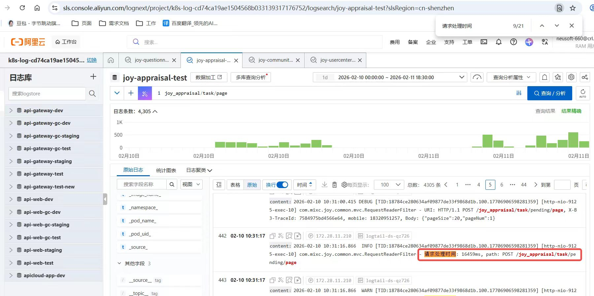
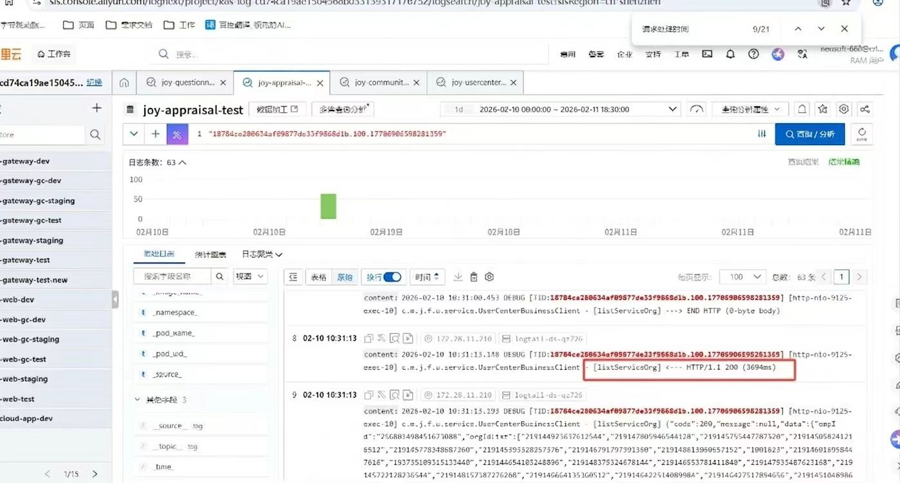
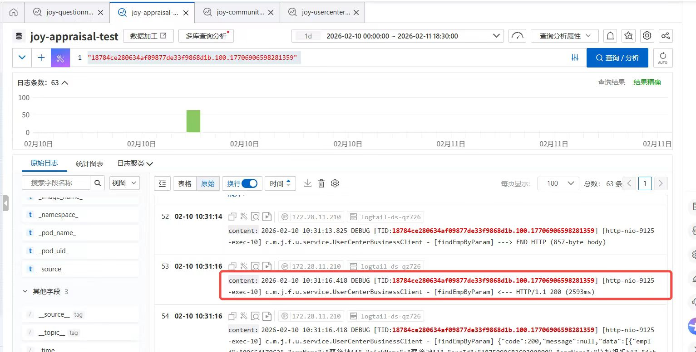

**Bottleneck 2: The 110k Data Explosion & The `COUNT` Trap**
Database interceptors exposed the most fatal flaw: Certain regional accounts were querying permission scopes encompassing an astonishing **111,993 employees**. This massive data fan-out caused MySQL indexes to fail entirely, with a single underlying `COUNT` query consuming **9,573ms**.
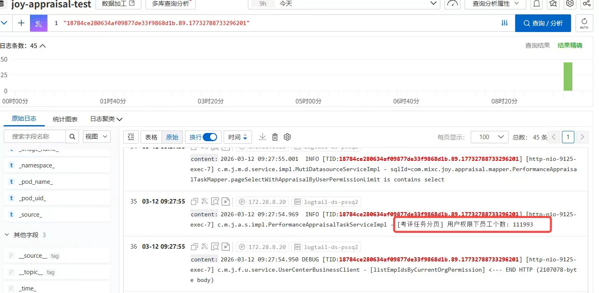
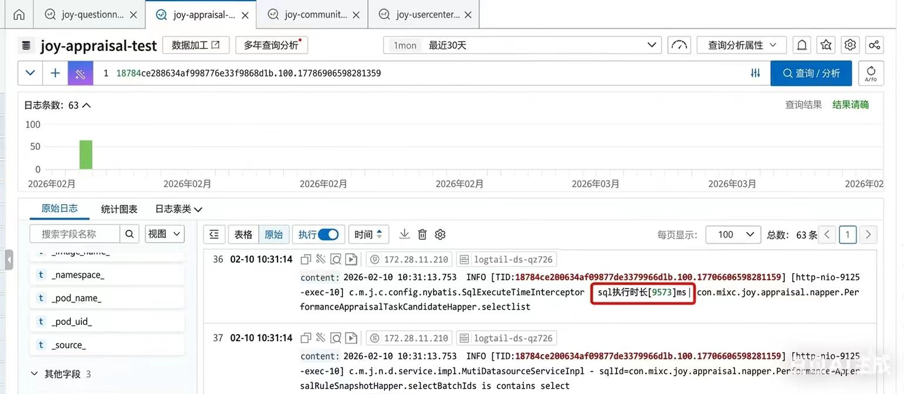

## 3. Data-Driven Architectural Decision
Instead of over-engineering a global caching solution, I queried the production database to analyze the actual blast radius:
1. **The Majority:** Global Admins (who bypass permission filters) were being unfairly bottlenecked by shared database congestion.
2. **The Edge Cases:** There were **exactly 26 non-admin accounts** in the entire system that hit the ">1000 employees" extreme threshold.

## 4. The Pragmatic Solution: Targeted Memory Pagination & Bulkhead Isolation
Based on the data, I implemented a highly targeted, cost-effective degradation strategy:
1. **Admin Fast-Track:** Bypassed the heavy permission logic entirely for administrators, pushing pagination directly down to the DB layer to utilize native indexes.
2. **Targeted Degradation for the 26 Edge-Case Accounts:**
   * **Killing the Slow SQL:** Abandoned database `IN` and `COUNT` queries for these 26 users. Shifted to a chunk-based **Memory Intersection Pagination** approach.
   * **OOM Safeguard (Process Lock):** To prevent these massive 110k-user queries from causing JVM Out-of-Memory (OOM) errors and crashing the Pods, I implemented a strict **Concurrency Process Lock**. The system gracefully limits concurrent heavy queries, acting as a bulkhead to protect the cluster.

## 5. Production Results & Full-Stack Verification
Post-deployment, the system exhibited a night-and-day transformation:

**For Admins (The Majority): Blistering Speed**
* Frontend UX: Chrome DevTools Network captures the API returning in **444ms**.
* Backend & SQL: Total processing time crushed down to **471ms**, and the complex permission COUNT query executes in a mere **95ms**.
  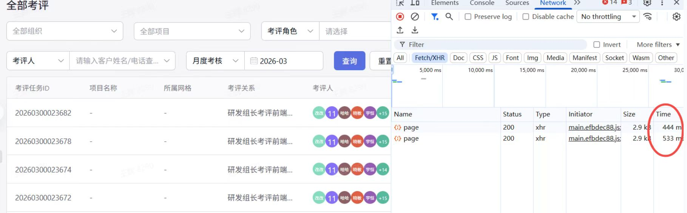
  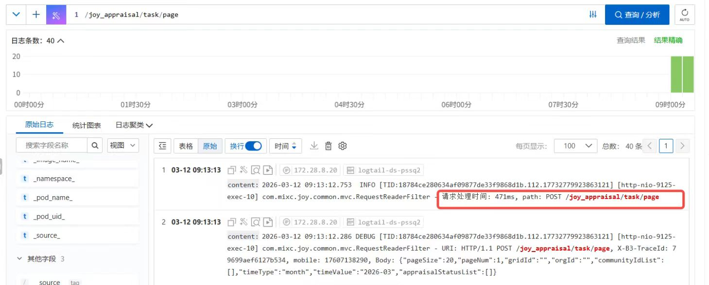
  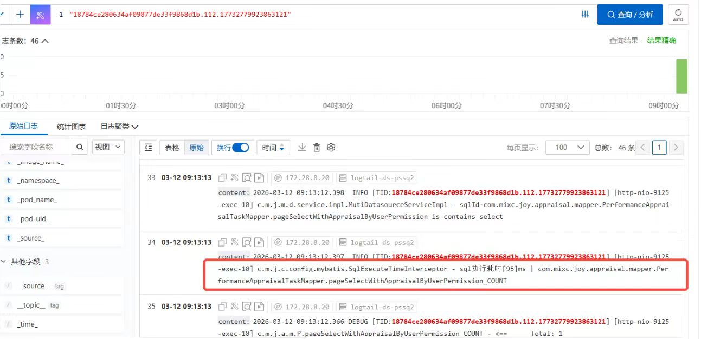

**For the 26 Edge Cases (Boundary Defense): Safe Degradation**
* The fatal 16.4s queries were forcefully compressed. Frontend response is now a stable **2.44s**, with backend logs confirming execution in **2,363ms** (SQL portion reduced to 530ms). Pod OOM restarts were completely eradicated.
  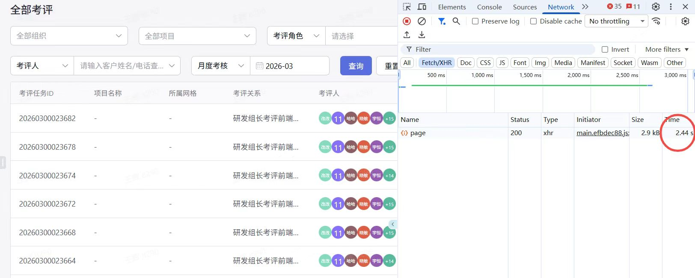
  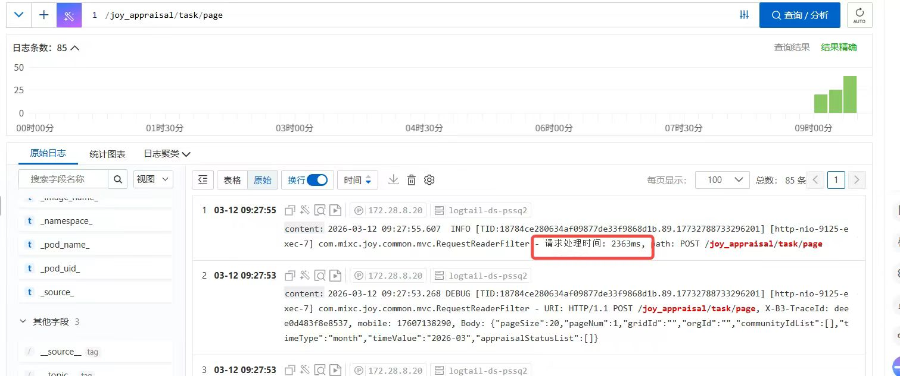
  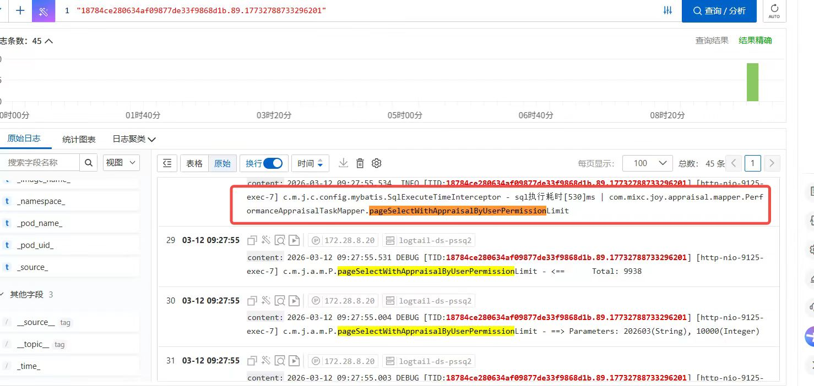

## 6. Core Architectural Code
Below are sanitized snippets demonstrating the Adaptive Routing and Concurrency Circuit-Breaker implemented to isolate these massive queries:
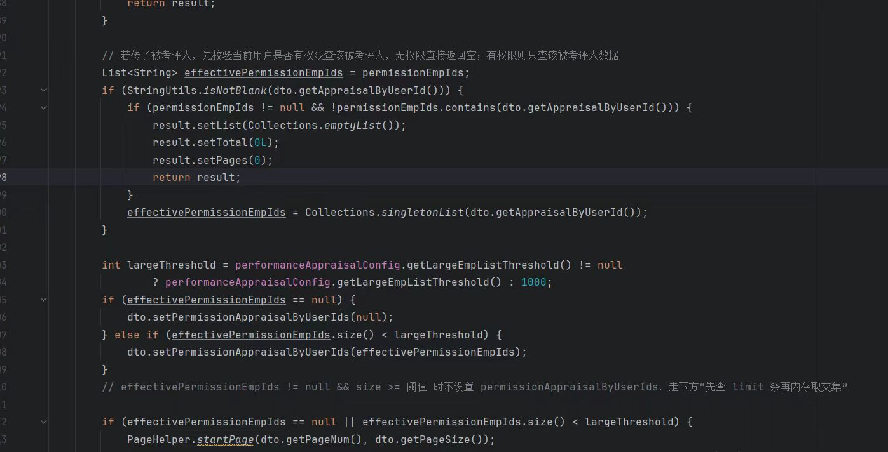
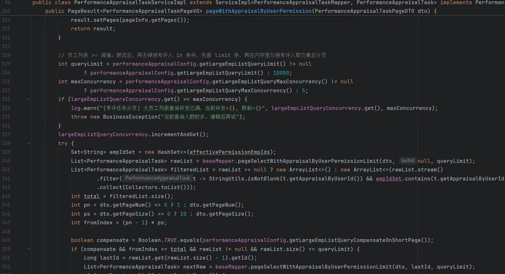